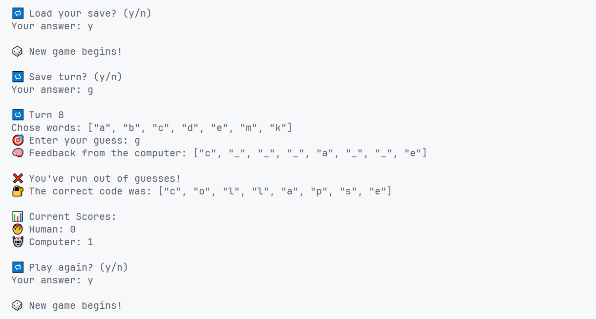

# 🎣 Hangman

This is the twelveth project from [The Odin Project](https://github.com/TheOdinProject) curriculum — a command line Hangman game where one player plays against the computer.

## ✨ Preview

## 🎮 Gameplay Instructions

- Winner gets 1 point. Scores show after each game.
- A new game starts after every round.
- Enter valid input only — wrong input might break the game.
- You can save your progress during a turn.
- Load your save to continue where you left off.
- You have 8 turns to guess the word.
- Feedback shows correct letters in their positions.
- Game ends when you guess the word or run out of turns.
- Enter valid input only — wrong input might break the game

## 🛠️ Skills Learned

### ♦️ Ruby Basics

- Basic Data Types
- Variables
- Input and Output
- Arrays
- Hashes
- Methods
- Range
- Basic Enumerable Methods
- Linting and RuboCop
- Object Oriented Programming
- Project Management
- Nested Collections
- Files and Serialization
